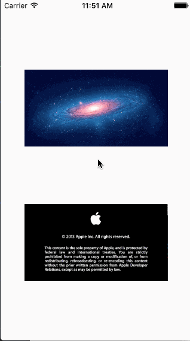

# XLMediaZoom

<p align="left">
<a href="https://travis-ci.org/xmartlabs/XLMediaZoom"></a>

<a href="https://developer.apple.com/swift"></a>
<a href="https://github.com/Carthage/Carthage"></a>
<a href="https://cocoapods.org/pods/XLActionController"></a>
<a href="https://raw.githubusercontent.com/xmartlabs/XLMediaZoom/master/LICENSE"></a>
</p>

By [Xmartlabs SRL](http://xmartlabs.com).

## Introduction

XLMediaZoom is a library to display images and video in fullscreen with blur and zooming capabilities.



## Usage

```swift
import XLMediaZoom
//Initialize both your image and the mediaZoom view associated.
let imageView = UIImageView(frame: CGRect(x: 0, y: 0, width: 240, height: 120))
let mediaZoom = MediaZoom(with: imageView, animationTime: 1, useBlur: true)

//Add the mediaZoom view to your superView and show it.
view.addSubview(mediaZoom)
mediaZoom.show()

```

## Requirements

* iOS 9.0+
* Xcode 8.0+

## Getting involved

* If you **want to contribute** please feel free to **submit pull requests**.
* If you **have a feature request** please **open an issue**.
* If you **found a bug** or **need help** please **check older issues, [FAQ](#faq) and threads on [StackOverflow](http://stackoverflow.com/questions/tagged/XLMediaZoom) (Tag 'XLMediaZoom') before submitting an issue.**.

Before contribute check the [CONTRIBUTING](https://github.com/xmartlabs/XLMediaZoom/blob/master/CONTRIBUTING.md) file for more info.

If you use **XLMediaZoom** in your app We would love to hear about it! Drop us a line on [twitter](https://twitter.com/xmartlabs).

## Examples

Follow these 3 steps to run Example project: Clone XLMediaZoom repository, open XLMediaZoom workspace and run the *Example* project.

## Installation
Version `3.0.0` has been rewritten completely in swift3, if you still need Objective-C support please target `v2.0.2`

#### CocoaPods

[CocoaPods](https://cocoapods.org/) is a dependency manager for Cocoa projects.

To install XLMediaZoom, simply add the following line to your Podfile:

```ruby
pod 'XLMediaZoom', '~> 3.0'
```

#### Carthage

[Carthage](https://github.com/Carthage/Carthage) is a simple, decentralized dependency manager for Cocoa.

To install XLMediaZoom, simply add the following line to your Cartfile:

```ogdl
github "xmartlabs/XLMediaZoom" ~> 3.0
```

## Author

* [Xmartlabs SRL](https://github.com/xmartlabs) ([@xmartlabs](https://twitter.com/xmartlabs))

# Change Log

This can be found in the [CHANGELOG.md](CHANGELOG.md) file.
